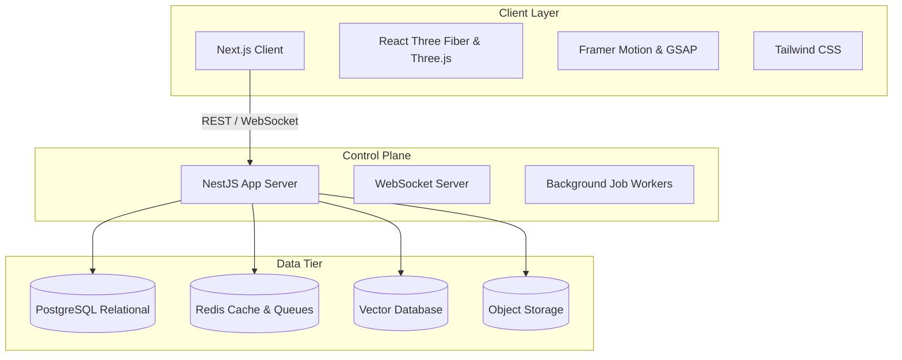

# Layer 1 — Infrastructure

The Infrastructure layer defines the hosting, execution, and storage environment that UIOS runs on. The system uses a decoupled frontend-backend architecture designed for low-latency visual performance and scalable AI execution.

---

## 💻 Tech Stack Specification

### 1. Frontend Architecture
- **Framework**: Next.js (App Router) with TypeScript.
- **Rendering & Styling**: Tailwind CSS for UI layouts.
- **Dynamic 3D Canvas**: Three.js mapped through `@react-three/fiber` for the "Fabric of Intelligence" interactive simulation.
- **Animation Orchestration**: 
  - GSAP for high-performance timeline manipulations, camera sweeps, and physics-like interpolation.
  - Framer Motion for standard UI entry/exit state transitions, drawer overlays, and button micro-interactions.

### 2. Backend & Runtime Architecture
- **App Server**: Node.js utilizing NestJS for a structured, modular dependency-injection framework.
- **APIs**: Stateless REST API controllers for metadata configuration, dashboard data, and authentication.
- **Real-Time Delivery**: WebSocket Server (`socket.io` or NestJS WebSockets) for streaming tokens, agent execution updates, and hot reloading workspace states.
- **Asynchronous Execution**: BullMQ or NestJS task queues running background job workers to handle file ingestion, vector generation, and long-running workflow steps without blocking API threads.

### 3. Database & Storage Tier
- **Relational Storage**: PostgreSQL to manage tenant data, organizations, workspace sessions, RBAC configurations, project records, API keys, and workflow logs.
- **Caching & Queue broker**: Redis to cache routing maps, session state, rate limit records, and orchestrate background queue jobs.
- **Semantic Vector Storage**: pgvector extension (integrated in PostgreSQL) or specialized engines (e.g., Pinecone, Qdrant) to manage high-dimensional embeddings for memory retrieval.
- **Object Storage**: S3-compatible cloud storage for secure storage of user-uploaded files, model adapters, and platform export bundles.

---

## 🌐 Hosting & Operations

- **Frontend Deployment**: Vercel (Edge network routing, caching static assets, rendering server components).
- **Backend Deployment**: Containerized hosting (Kubernetes, AWS ECS, or GCP Cloud Run) supporting persistent WebSocket connections.
- **Content Delivery Network (CDN)**: Global CDN (Cloudflare or CloudFront) to cache system models, assets, and route API calls with edge SSL decryption.
- **Monitoring & Observability**: OpenTelemetry collection agents pushing metrics, traces, and performance logs to centralized monitors (Datadog, Prometheus/Grafana).
- **Backups & Disaster Recovery**: Point-in-time recovery (PITR) for databases, multi-region database replication, and daily cold snapshots of object storage.
