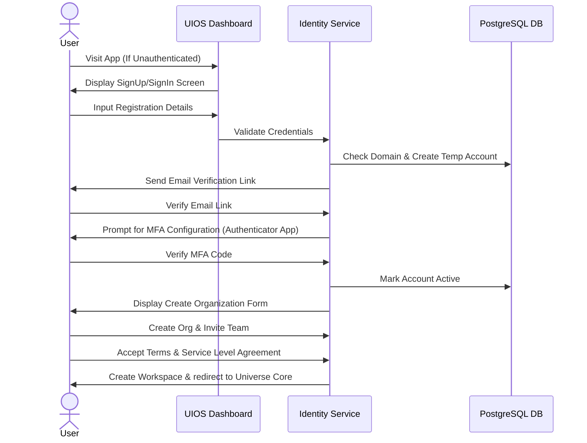

# Layer 2 — Identity & Access Control

Identity is the boundary checkpoint for every transaction inside UIOS. The platform enforces strict multi-tenant isolation, ensuring data separation and auditable access control at every organizational tier.

---

## 🔑 Tenancy Structure & Hierarchy

Data inside UIOS is strictly containerized through a nested ownership model:

```text
Organization (Billable Entity, Domain Control, Governance)
   ↓
   Workspace (Isolated Team Space, Project Cluster)
      ↓
      Projects (Specific Task Contexts)
         ↓
         Agents (Local LLM Agents)
            ↓
            Memory (Contextual Storage)
               ↓
               Integrations (Connected App Instances)
```

### 1. Structure Tiers
- **Organization (Tenant)**: The top-level root. Owns domains, billing contracts, identity provider connections (SAML/SCIM), audit logs, and global governance rules.
- **Workspace**: A partitioned region within an Organization. Workspaces hold specific projects, keys, and connectors. Members are assigned explicitly to workspaces.
- **Projects**: Sub-folders within a workspace to group related tasks, agent configurations, and memories.
- **Agents**: Autonomous AI configurations operating within project boundaries.
- **Memory**: Vector and conversational context linked directly to the executing Workspace or Project.
- **Integrations**: Connected third-party API credentials (e.g., GitHub, Slack) authorized inside the workspace.

---

## 🚦 Registration & Authentication Flow

When a user lands on UIOS:



### 2. Authentication Rules
- **Closed-Loop Authentication**: Authentication must fail-closed. If token validation or user status lookup encounters an database error, access is immediately denied.
- **MFA Policy**: Multi-factor authentication is optional for Free tier, but can be forced organization-wide via Enterprise domain configurations.
- **Tenant Verification**: Every API header containing tenant IDs (`X-Tenant-ID`) is validated on the server side using the signed session JWT. **Never trust client-supplied tenant headers without server-side validation.**
