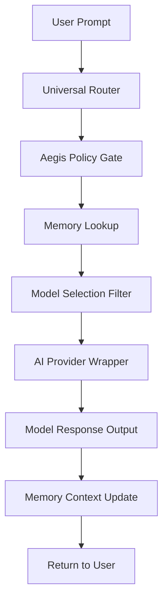

# Layer 4 — Universal Router

The Universal Router is the dynamic routing hub and orchestrator of all AI operations inside UIOS. Rather than talking to models directly, all user prompts, workflows, and agent actions pass through the Router to optimize latency, cost, and output quality.

---

## ⚡ The Unified Request Pipeline

Every AI request follows a strict sequential lifecycle:

1. **User Prompt Ingestion**: The payload (prompt context, session ID, tenant metadata) is received via REST or WebSockets.
2. **Aegis Policy Check**: Enforces boundaries, permissions, and filters unsafe content.
3. **Memory Lookup**: Searches semantic and conversation history databases to augment the prompt with matching context.
4. **Model Selection**: Evaluates model characteristics (cost, availability, latency) to select the optimal model.
5. **Provider Execution**: Invokes the target provider wrapper (OpenAI, Anthropic, Gemini, Ollama, etc.) with standardized schemas.
6. **Response Ingestion**: Parses raw response formats into a unified UIOS contract structure.
7. **Memory Update**: Encodes response details back into the conversation logs and vector stores.
8. **Sanitized Output Delivery**: Delivers the result to the client stream.

---

## ⚙️ Router Decision Engines

The Router acts as a rule-based gateway to optimize operations across several variables:

- **Model Selection**: Dynamically matches tasks to the appropriate model class:
  - *Advanced reasoning* (e.g., complex coding, data analysis) → Gemini 1.5 Pro / Claude 3.5 Sonnet.
  - *Fast chat & extraction* → Gemini 1.5 Flash / GPT-4o-mini.
- **Provider Status**: Checks health checks (`/api/provider/health`). If a provider reports high error rates or latency, the router reroutes requests to a fallback model.
- **Cost Calculation**: Translates token counts into cost metrics using current plan parameters.
- **Latency Optimization**: Selects regional endpoints and models based on real-time execution speeds.
- **Permissions Gate**: Checks if the workspace is authorized to utilize the selected model class.
- **Retry Mechanics**: Employs exponential backoff with jitter on transient network failures.
- **Caching**: Leverages Redis cache blocks for identical prompts with static contexts.
- **Telemetry logging**: Logs input/output metrics to the system analytics database.
