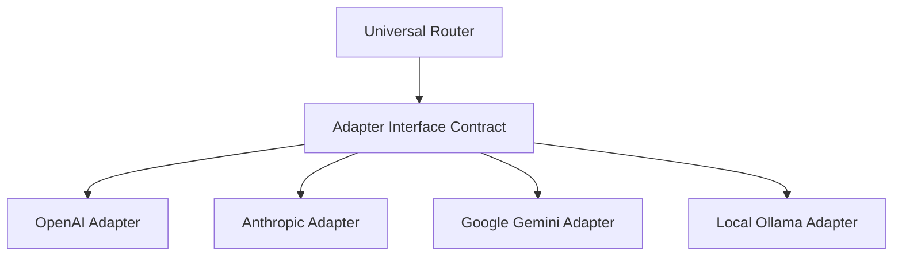

# Layer 7 — AI Provider Adapters

The AI Provider layer abstracts model execution. UIOS interacts with provider APIs through a standardized interface contract. This design allows new models to be added, monitored, and optimized without changing upstream routing, memory, or security systems.

---

## 🔌 Standardized Provider Interface

Every AI provider adapter must implement the base contract class:

```typescript
export interface AIProviderAdapter {
  id: string;
  name: string;
  
  /**
   * Standardized chat execution contract
   */
  generateChatResponse(
    request: UnifiedChatRequest,
    options?: RequestOptions
  ): Promise<UnifiedChatResponse>;

  /**
   * Standardized streaming tokens contract
   */
  streamChatResponse(
    request: UnifiedChatRequest,
    options?: RequestOptions
  ): AsyncIterable<UnifiedChatTokenStream>;

  /**
   * Health verification checkpoint
   */
  checkHealth(): Promise<ProviderHealthStatus>;
}
```

---

## 🛠️ Adapter Ecosystem



- **OpenAI Adapter**: Maps standard chat payload formats to the OpenAI chat completions endpoint (e.g., `gpt-4o`, `o1`).
- **Anthropic Adapter**: Manages Claude API calls, handles system prompt placement rules, and handles API errors.
- **Gemini Adapter**: Directs requests to Gemini API endpoints (e.g., `gemini-1.5-pro`, `gemini-1.5-flash`), supporting multi-modal inputs and structured JSON schemas.
- **Ollama Adapter**: Connects to locally running model endpoints to support offline or private developer workspaces.
