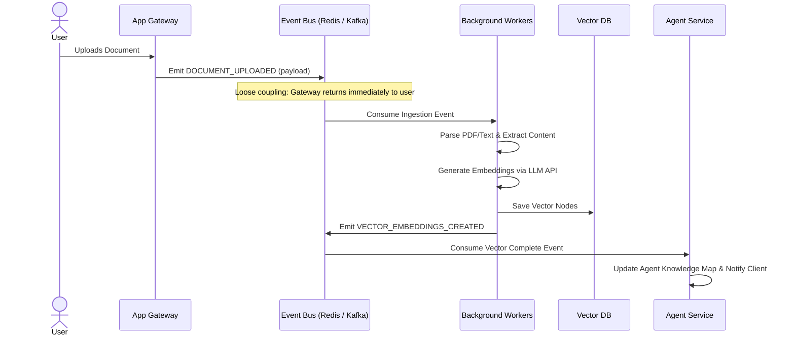

# Layer 9 — Event-Driven Engine

UIOS relies on an asynchronous event-driven design to ensure decoupled components, resilient background job processing, and reactive UI updates.

---

## 📣 Event-Driven Document Ingestion Lifecycle

This example demonstrates how an ingestion event propagates through the system:

---

## ⚡ Event Bus Architecture

- **Event Broker**: Redis Pub/Sub for fast, volatile, real-time message passing (e.g., streaming tokens to WebSockets). BullMQ handles persistent background job queues.
- **Payload Constraints**: Events must include tenant and workspace metadata to guarantee security scoping at the consumption end.
- **Failures & Dead-Letter Queues (DLQ)**: Failed event workers retry with exponential backoff. Persistent failures are moved to a DLQ for operational review, keeping system pipelines flowing.
- **Loose Coupling**: Frontend operations emit events and return immediately, preventing slow vector extraction or model calls from blocking web requests.
