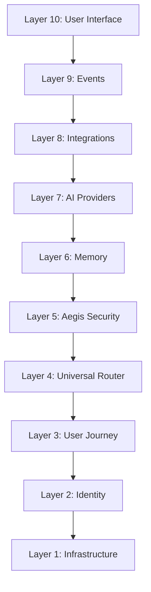

# UIOS Engineering Handbook

Welcome to the **UIOS Engineering Handbook**. This manual serves as the authoritative blueprint and specification for the UIOS platform. Every architect, designer, developer, and AI coding agent must review this manual before planning, implementing, or verifying features.

## The Core Product Vision
UIOS is an **AI operating layer and control plane**, not a desktop operating system. It is designed to coordinate models, memory layers, agents, workflows, and integrations into a single unified workspace. 

The signature design pattern is **The Fabric of Intelligence**—an organic, living mycelium web representing the dynamic routing, policy boundaries, and semantic context of active workflows.

---

## Handbook Structure

The architecture is divided into **10 core layers**, along with our operational checkpoints and development processes:

### Table of Contents

1. [Layer 1: Infrastructure](file:///f:/UIOS/docs/handbook/01_infrastructure.md)
   - Core technology stack (Next.js frontend, NestJS WebSocket/REST backend, PostgreSQL, Redis, Vector Databases, Hosting, CDN, Monitoring).
2. [Layer 2: Identity & Access Control](file:///f:/UIOS/docs/handbook/02_identity.md)
   - Registration, MFA, and tenant containment boundaries (Organization → Workspace → Projects → Agents → Memory → Integrations).
3. [Layer 3: User Journey](file:///f:/UIOS/docs/handbook/03_user_journey.md)
   - Step-by-step visitor onboarding flow, from landing page to developer space building.
4. [Layer 4: Universal Router](file:///f:/UIOS/docs/handbook/04_universal_router.md)
   - Request-response lifecycle, pathing engine, cost, latency, retries, caching, and model selection.
5. [Layer 5: Aegis Security Plane](file:///f:/UIOS/docs/handbook/05_aegis_security.md)
   - Same-origin checks, RBAC gates, API key checking, rate limits, audit logging, content policy checks, and fail-closed structures.
6. [Layer 6: Multi-Tier Memory](file:///f:/UIOS/docs/handbook/06_memory.md)
   - Session, conversation, workspace, and organization memories. Semantic vector storage and Knowledge Graph indexing.
7. [Layer 7: AI Provider Adapters](file:///f:/UIOS/docs/handbook/07_ai_providers.md)
   - Provider-neutral wrapper contracts enabling plug-and-play integrations with OpenAI, Anthropic, Gemini, Ollama, etc.
8. [Layer 8: Integrations & Connectors](file:///f:/UIOS/docs/handbook/08_integrations.md)
   - Standardized connector contracts (auth, sync, error mapping) for GitHub, Slack, Notion, Jira, Google Drive, Teams, Salesforce.
9. [Layer 9: Event-Driven Engine](file:///f:/UIOS/docs/handbook/09_events.md)
   - Event pub/sub structure, ingestion streams, vector encoding pipelines, and real-time agent notifications.
10. [Layer 10: Cinematic User Interface](file:///f:/UIOS/docs/handbook/10_user_interface.md)
    - Design tokens, responsive web layout, fluid 3D Canvas overlays, and universe navigation regions.
11. [Development Operations & Rules](file:///f:/UIOS/docs/handbook/11_development_operations.md)
    - Security Checkpoints, Development Workflow Lifecycles, Platform Ground Rules, and Monetization models.

---

## Platform Ground Rules (Quick Reference)

Before coding any new feature, it **must** solve or define:
1. **User Problem**: What user friction does this feature solve?
2. **Subsystem Ownership**: Which layer owns the logic and database schemas?
3. **Aegis Gate**: How is identity and tenant isolation enforced?
4. **Events**: What telemetry and pub/sub events are emitted?
5. **Fail-Safe**: How does this feature fail safely if model endpoints or databases are offline?
